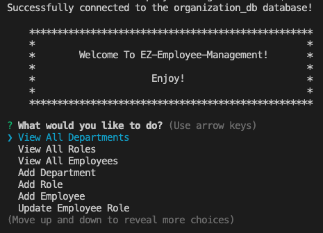
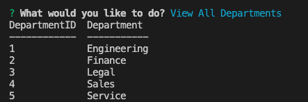
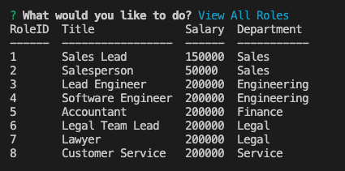
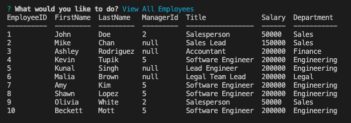
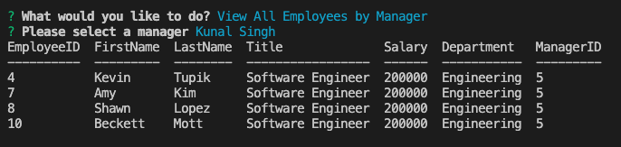
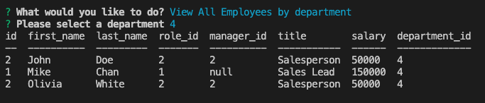
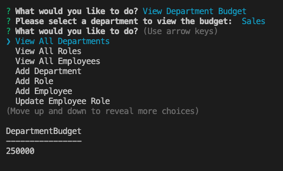

# EZ-Employee-Management 

  ## Table of contents:
  ### 
  1. [Description](#description)
  2. [Features](#features)
3. [Installation](#installation)
4. [Demo](#demo)
5. [License](#license)
6. [Tests](#tests)
7. [Questions](#questions)

  ---

  ## Description 
  ### An interface that allow non-developers to easily view and interact with information stored in databases. This interface is a command-line application. As a business owner, able to view and manage the departments, roles, and employees in the company, easy to organize and plan business.
  ---
  ## Features

   * With options to view all departments, view all roles, view all employees, add a            department, add a role, add an employee, and update an employee role
   * a formatted table showing department names and department ids
   * the job title, role id, the department that role belongs to, and the salary for roles
   * a formatted table showing employee data, including employee ids, first names, last names, job titles, departments, salaries, and managers that the employees report to
   * able to enter the name of the department and that department is added to the database
   * able to enter the name, salary, and department for the role and that role is added to the database
   * able to to enter the employee’s first name, last name, role, and manager, and that employee is added to the database
   * able to to select an employee to update and their new role and this information is updated in the database
   
   
   
   
   
   
   
   
  ---
  ## Installation
   * inquirer package (npm i inquirer@8.2.4), 
   * console.table
   * mysql2

  ---

  ## Demo

https://user-images.githubusercontent.com/113266025/199441887-1e7dd21e-52ca-48af-ad9b-4d6d5272997e.mp4

  ---

  ## License
  ### MIT
  * Read more about MIT: https://opensource.org/licenses/MIT 

  ---

  ## Tests 
    None
  ---
  
  ## Questions
  ### Reach me with additional questions:
  * Github Link: https://github.com/ahhyaya
  * Project Link(Github): https://github.com/ahhyaya/EZ-Employee-Management
  * Email Address: toruig59@gmail.com